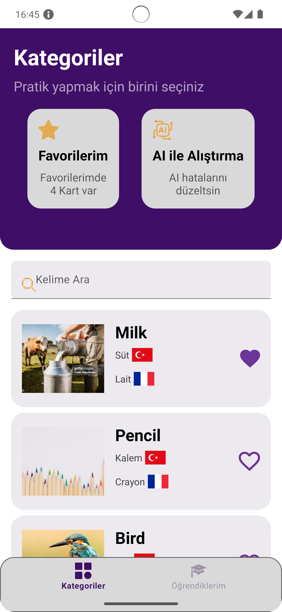
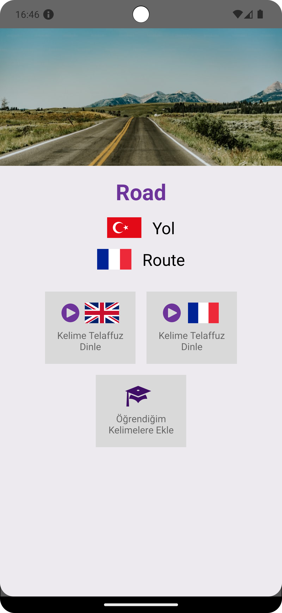
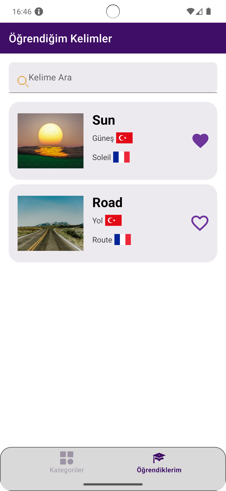
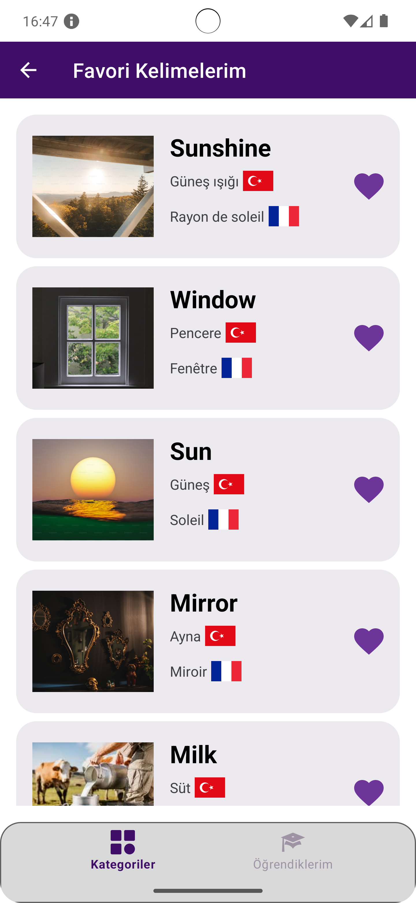
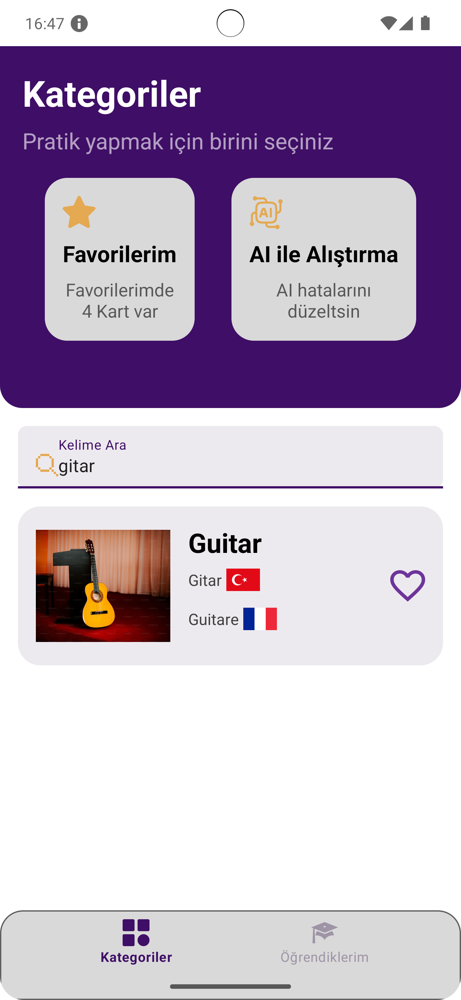

# Multilingual Word Learning App

## Project Overview

This project aims to develop an application that displays at least 50 words and their meanings in different languages. Users can view the words in a list and mark them as "Learned." The UI design is flexible, allowing for creative approaches. The app is divided into two main sections: a random list of words and a list of learned words.

## How to Use the App

1. **Explore Words**
   - Navigate through the random list of words in the first tab.

2. **Mark Words as Learned**
   - Click on any word to see its details. Use the "Learned" button to mark it as learned, moving it to the second tab.

3. **View Learned Words**
   - Switch to the second tab to see words you have marked as learned. You can unlearn them by clicking the "Unlearned" button, which will add them back to the first tab.

4. **Shuffle the List**
   - Use the swipe-to-refresh gesture on the first tab to reshuffle the word list randomly.

## Libraries and Tools Used
- 100% [Kotlin](https://kotlinlang.org/)
  based [Coroutines](https://github.com/Kotlin/kotlinx.coroutines) [Flow](https://developer.android.com/kotlin/flow)
  for asynchronous.
  
- [Android Architecture Components](https://developer.android.com/topic/architecture/intro?hl=en) -
  Collection
  of libraries that help you design robust, testable, and maintainable apps.
    - A single-activity architecture, using
      the [Navigation](https://developer.android.com/guide/navigation) to manage composable
      transactions.
    - Lifecycle - perform an
      action when lifecycle state change
    - [ViewModel](https://developer.android.com/topic/libraries/architecture/viewmodel?hl=en) -
      Stores
      UI-related data that isn't destroyed on UI changes.
    - [UseCases](https://developer.android.com/topic/architecture/domain-layer?hl=en) - Located
      domain
      layer
      that sits between the UI layer and the data layer.
    - [Repository](https://developer.android.com/topic/architecture/data-layer?hl=en) - Located in
      data
      layer that contains application data and business logic
- **Jetpack Navigation**: To manage screen navigation and popups.
- **ViewBinding**: To efficiently manage views and data.
- **Room**: For storing learned words locally.
- **RecyclerView / ViewPager**: For displaying word lists dynamically.
- **BottomNavigationView**: For managing the main navigation between the two tabs.
- **Retrofit**: construct the REST APIs and paging network data.
- **Coil**:  Image loading library
- **Hilt**: Dependency Injection Library

## Ekran Görüntüleri

|                                   |                                    |                               |                                               |       |
|---------------------------------------------------------|-----------------------------------------------|--------------------------------------------------------------------------|------------------------------------------------------------------------------|------------------------------------------------------------------------------|
|  |  |  |  |  |

